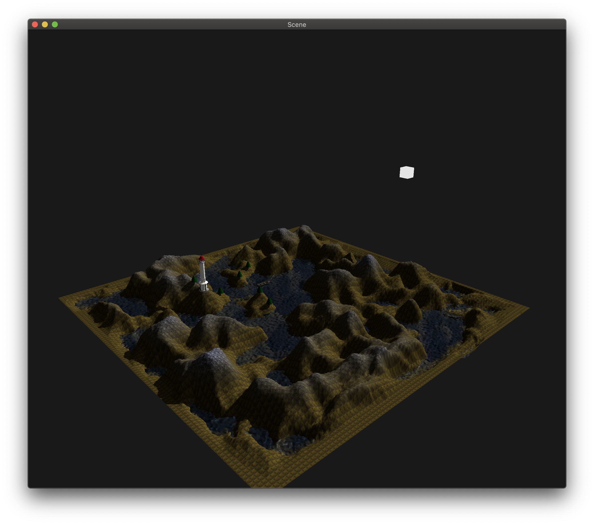

# Fractal example

- 3.3 core profile
- prereqs - conan, cmake, c++17 (preferably clang)
- deps - glfw, glew, imgui, glm, stb, assimp, fmt

# How to build and run:

```shell
./build.sh && ./run-no-forward-compat.sh
```

or

```shell
./build.sh && ./run.sh
```

# Controls

- `space + mouse move` - rotate camera
- `wasd` - move camera

# Previews




